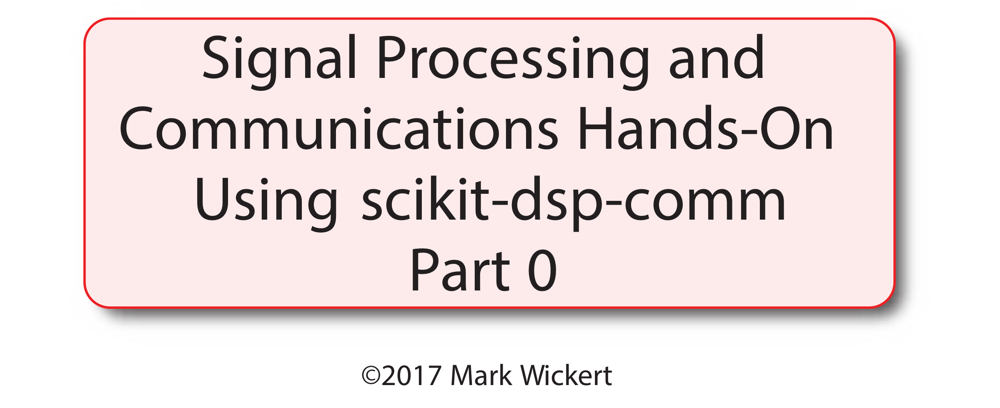
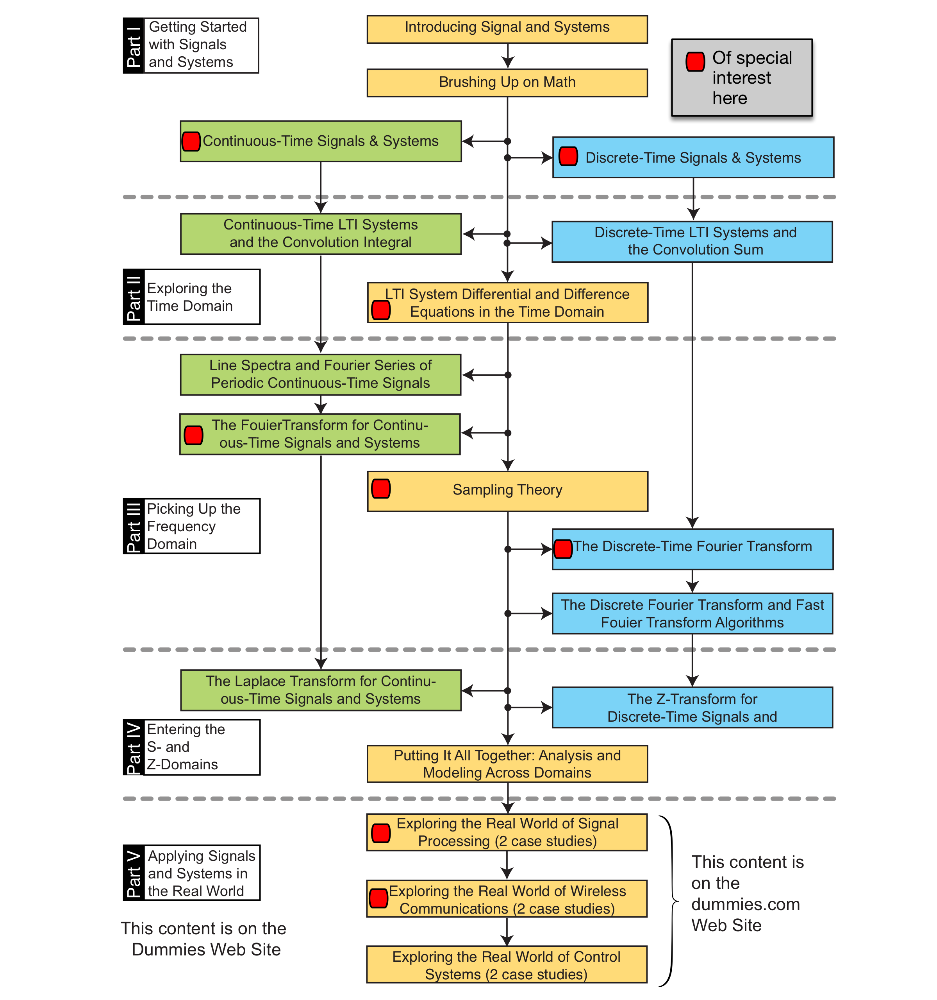
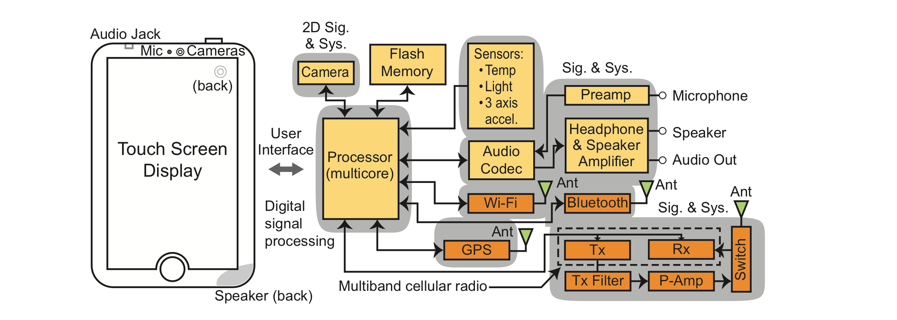
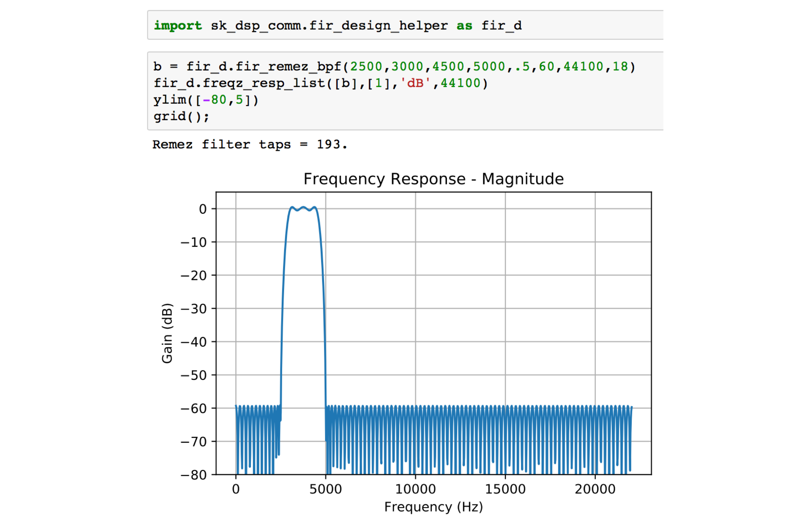
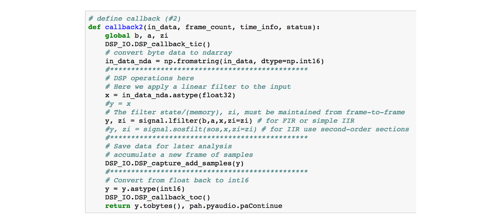
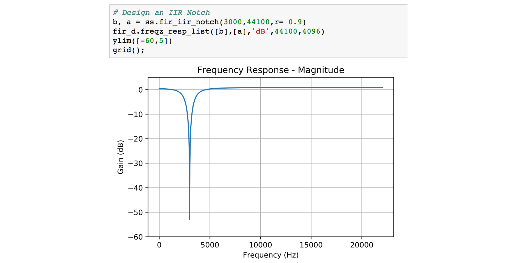
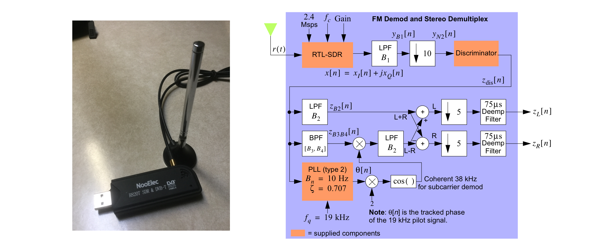
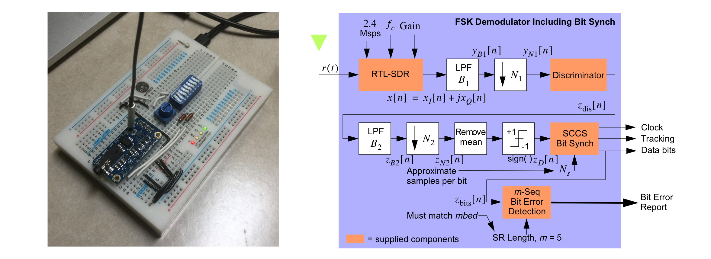
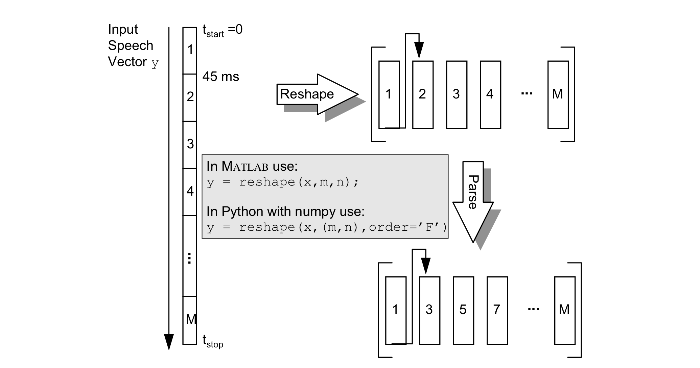
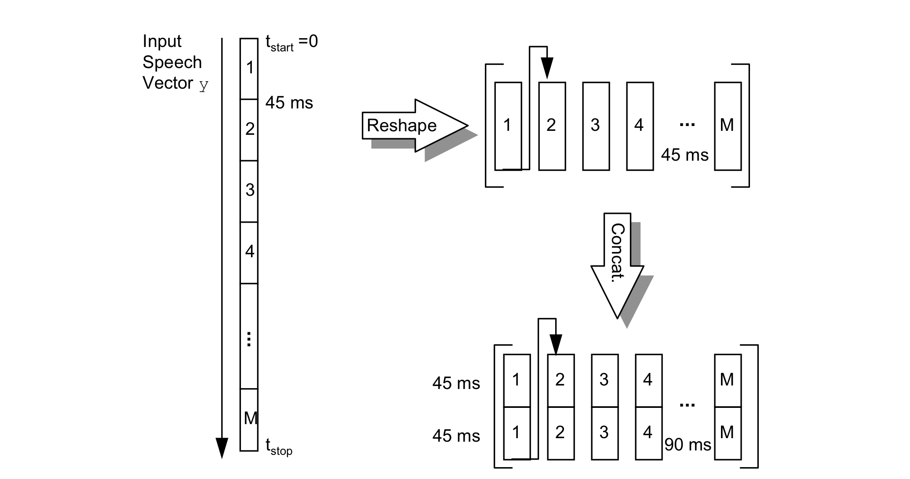

> Reading the PDF version of this `markdown` document is best, unless you have say [Typora](https://typora.io) installed. The equations will be properly rendered.

# Introduction and Session Overview

* Who am I?
* What is `scikit-dsp-comm` and what is its history
* Key signal processing and communications topics I will cover
* Working the first *Lab* involving speech capture using PyAudio and then simple speech processing

## What is `scikit-dsp-comm`
* The package started while I was writing the book [*Signals and Systems for Dummies*, Wiley 2013](https://www.amazon.com/s/ref=nb_sb_ss_i_8_12?url=search-alias%3Daps&field-keywords=signals+and+systems+for+dummies&sprefix=signals+and+%2Caps%2C165&crid=K43FJ5JQXZZA&rh=i%3Aaps%2Ck%3Asignals+and+systems+for+dummies)
* I needed to create a lot of technical charts and diagrams for the book and started use `matplotlib`, but then needed a code base, and then well, others like my students, might want to use it too
* The module `sigsys.py` was developed to support the topics of the book as shown in the flowchart below: 

* I started using Python and the SciPy-Stack in my teaching Fall 2014, after returning from a sabbatical, I started adding more capability and see more to go
  * Python is now the mainstay modeling and simulation tool in all of my classes and my consulting work
  * C and C++ are also import in my work; especially for embedded systems and calculation intensive simulations

### Modules

* The current modules:

* There are more functions and classes developed, just need to find the time (and the students) to move them into the code base
* The newest module is `pyaudio_helper`; something I have wanted to start on for the past few years, but was waiting for the right time

## What is Signal Processing and Where is it Used?

**Cellphone Block Diagram** - A Signal Processing/Communications Slant

**Automobile Cruise Control** - A Signal Processing/Control Systems Slant

## DSP-Comm Topics Covered

- Introduction/review of continuous and discrete signals and systems modeling
  - How `scikit-dsp-comm` plays a part
  - An emphasis here is on filter design from amplitude response requirements; both finite impulse response (FIR) and infinite impulse response (IIR)
- Audio processing applications
  - Post processing and playback using the `Audio()` widget in Jupyter notebook 
  - Real-time processing and playback using `Pyaudio` via `pyaudio_helper`
- Communications theory and signal processing implementation
  - Analog modulation theory and simulation
  - Digital modulation theory and simulation
  - Tools for modeling and simulation of digital comm systems
  - Receiver signal processing using `pyrtlsdr` to capture radio signals from a repurposed digital TV tuner

# Highlights of *Hands-on* Experiences
* Audio recording playback slow down/speed up without changing the pitch
* Waveform/signal synthesis, e.g., continous and discrete-time respectively, $x(t)$ and $x[n]$, from primitives
   * The frequency spectrum of a signal, e.g., continous and discrete-time respectively, $X(f) = \mathcal{F}\{x(t)\}$ and $X(e^{j2\pi f/f_s}) = \mathcal{F}\{x[n]\}$ 

* Systems (linear in most cases) that operate on signals, e.g., the *system function* representation  continous and discrete-time respectively,  $H(s)$ and $H(z)$, as ratios of polynomials in complex variables $s$ and $z$
   - Linear constant coefficient difference equations (LCCDE), e.g., for *causal* systems

   $$
   y[n]=-\sum_{k=1}^{N} a_k y[n-k] + \sum_{k=0}^M b_k x[n-k]
   $$

   - Frequency response, e.g., evaluate the system function, continuous and discrete respectively, be setting $s=j2\pi f$ and $z=e^{j2\pi f/f_s}$, where $j=\sqrt{-1}$ and $f_s=1/T$ is the sampling frequency and period respectively 
   - Simulation, e.g., turn the crank on the LCCDE using `y=signal.lfilter(b,a,x)`, where `b` and `a` are coefficient arrays corresponding to $a_k$ and $b_k$ in (1)

* Digital filter design, characterization, and test
   - Simple systems, e.g., $M$-tap moving average, first-order IIR, IIR notch
   - Design from amplitude response requirements, e.g., `fir_design_helper.py` and `iir_design_helper.py`

- Simulation
   - Real-time implementation using Pyaudio via `pyaudio_helper`

  

- Overview of real-time implementation in C using an embedded system; mock design for ARM Cortex-M4 processor with measured data provided in a file

* Removing narrowband interference from audio signals
  - Cascade of notch filters, e.g., excise signals not of interest and leave the rest of the signal intact

  

  - Adaptive FIR filter, e.g., adapt to statiscal characteristics of signals present removing say only narrowband interferers

* Audio special effects, e.g., echo, reverb, and *flanging*
  - Flanging in particular the function `digitalcom.time_delay`, which implements a time varying time delay (hence can introduce Dopper)

* Modulation and complex frequency translation to move the center frequency of a software defined radio (SDR) signal to a new center center frequency, e.g., $x[n] e^{j2\pi n f_0/f_s} \Leftrightarrow X(e^{j2\pi(f-f_0)/f_s})$

* Amplitude and frequency modulation
  - Transmitter
  - Receiver

* Processing software defined radio (SDR) signals using multi-rate DSP

* Receiving frequency-Shift Key (FSK) digital modulation from Arduino-based FM radio transmitter

# Lab 1: Use PyAudio to Record a Short Sentence (~5-10s) and then Process the Speech

* The use PyAudio to record your speech is optional, as test vectors are provided
* The primary objective is to use *butt splicing* via the `numpy` function `reshape()` to slow down and speed up the playback of a speech array without shifting the pitch

## Speedup Down Playback Approach

Repeat small slices of the speech `ndarray` as shown below:

## Slowdown Playback Approach

Remove small slices of the speech `ndarray` as shown below:

## Move to the Jupyter Notebook

* Open the Jupyter notebook file `Speech Processing.ipynb`

> ## Onward to Part 1

Following the *Speech Processing* lab we will move into an overview of signal and system modeling.