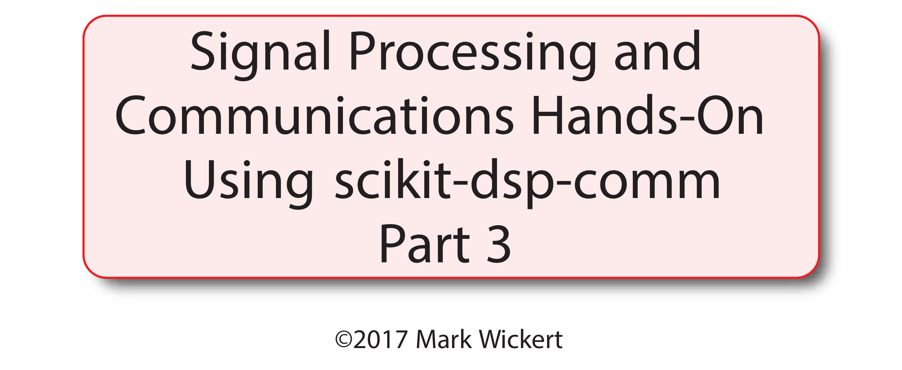
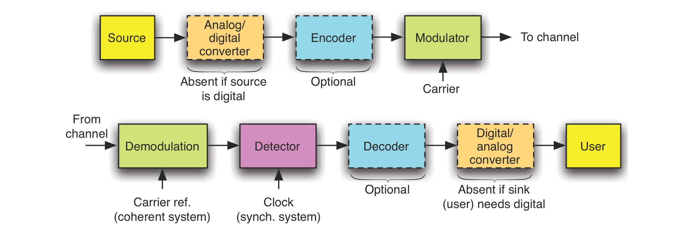
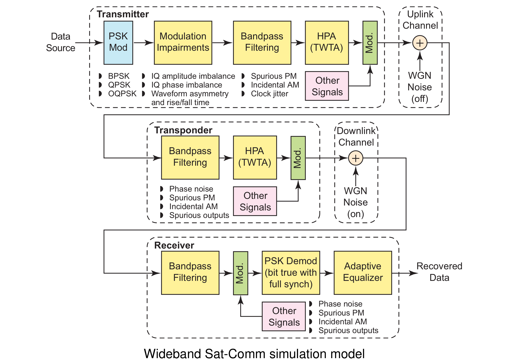
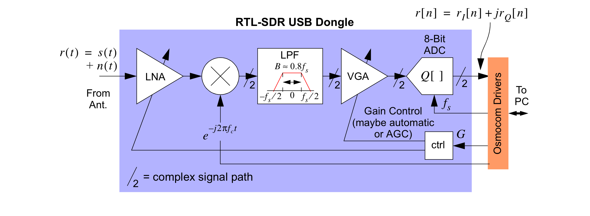
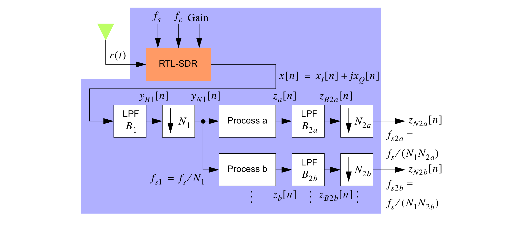
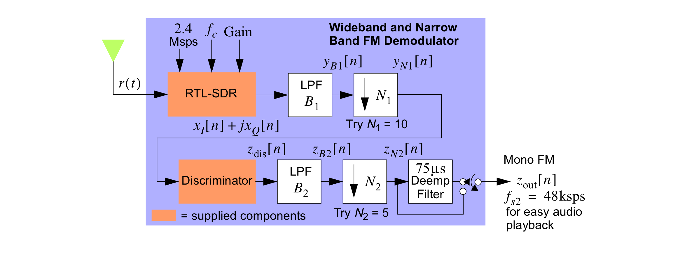
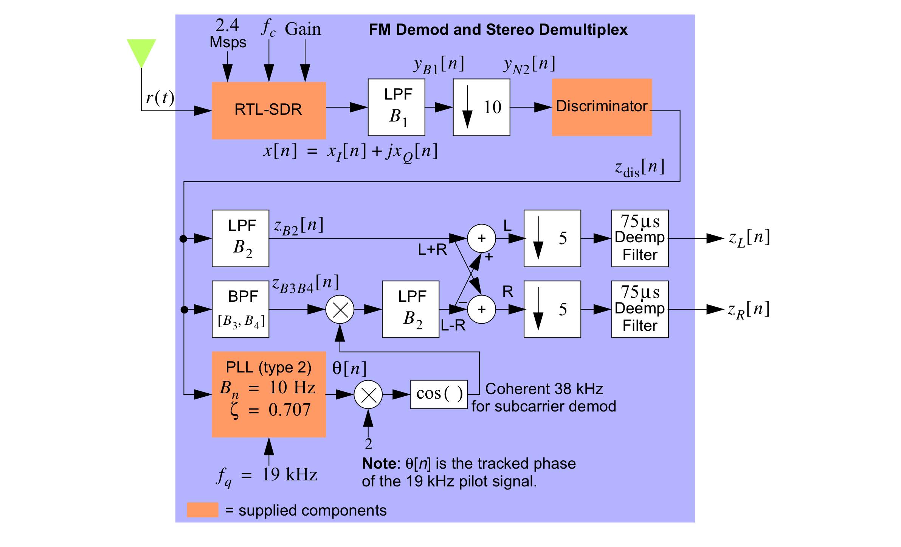
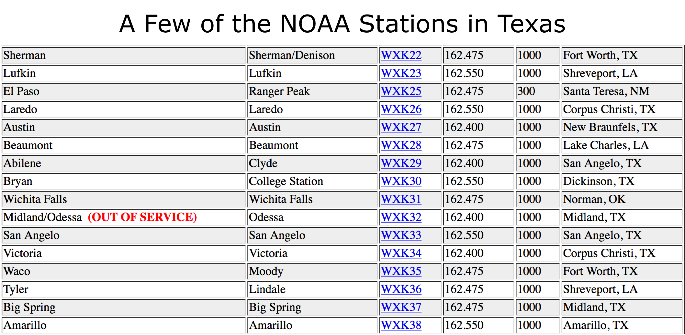
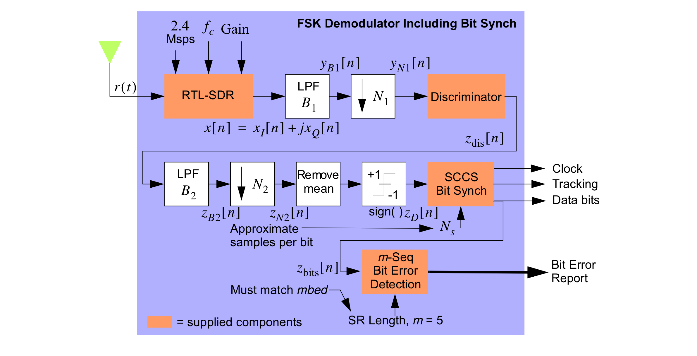
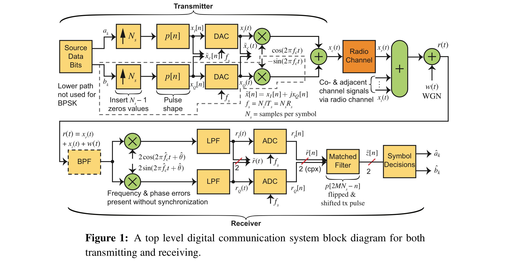

# Communications Theory & Practice

* In this part of the tutorial the focus is on signal processing for communications 


* The Labs will involve the use of the RTL-SDR or optionally archived captures found in the tutorial repository

## Top Level Block Diagram



* Communication system modeling and simulation are woven throughout all of the `scikit-dsp-comm` package

* The flavors of communication are *analog* and *digital* modulation
  * The above block diagram is digital as bits flow into the encode block and out the decoder block
  * To analog is a misnomer as the channel is waveform based, which is also analog signal processing too
  * In analog communications the message or information signal is directly *modulated* on to the channel

### Use Case: Modeling Satellite Commnunications Systems

  

## Baseband or Carrier Based

* The signals or waveforms that carry communication information are either *baseband* or *carrier* based
* Wired Ethernet is an example of baseband, as are interconnects within our devices
* Wireless communications uses a radio frequency (RF) carrier to allow free space propagation to serve as the channel to carry the signal from the transmitter (tx) to the receiver (rx)
  * There is also free space optical and optical fiber

### Carrier Modulation

* A modulated carrier can be represented as
$$
		x_c(t) = A(t)\cos\big[2\pi f_c t + \phi(t)\big]
$$
​	where $A(t)$ is linear modulation, $f_c$ the carrier frequency, and $\phi(t)$ is phase modulation

* Amplitude modulation is where radio started, and still is in use today in both analog and digital communications 

* Phase modulation encompasses frequency modulation (FM) as well, since the two are related by differentiation/integration, e.g.,

$$
\begin{align}
  	\phi(t) &= \text{Phase Deviation of the Carrier in radians} \\
  	\frac{1}{2\pi}\cdot\frac{d\phi(t)}{dt} &= \text{Frequency Deviation in Hz of the carrier}
  \end{align}
$$

### Carrier Demodulation in Python with the RTL-SDR

> **Demodulation**: Undoing at the receiver what was done at the transmitter to recover the data bits or analog signal

* As a quick review, an FM modulated carrier applies the message signal $m(t)$ to the carrier signal $x_c(t)$ such that the derivative of the phase deviation, $d\phi(t)/dt$, (also the frequency deviation) is proportional to the message:

$$
	x_c(t) = A_c\cos\big[2\pi f_c t + \phi(t)\big] = A_c\cos\left[2\pi f_c t + 2\pi k_d\int^t m(\alpha)d\alpha\right],
$$

​	where $k_d$ is the modulator frequency deviation constant.

* To demodulate FM you first consider the ideal discriminator which takes in $x_c(t)$ and operates on the phase deviation to produce

$$
	y_D(t)= \frac{1}{2\pi} K_D\frac{d\phi(t)}{dt}
$$

​	where $K_D$ is the discriminator gain constant

* Notice that for FM, that is $\phi(t) = 2\pi f_D \int^t m(\alpha) d\alpha$ as defined above,

$$
	y_D(t) = \underbrace{K_D}_{\text{v/Hz}}\cdot \underbrace{f_D}_{\text{v/Hz}}\cdot \underbrace{m(t)}_{\text{v}}
$$

* To demodulate FM, the *complex baseband discriminator*, also known as the *quadricorrelator*, has a convenient DSP implementation

* At complex baseband $x_c(t)$ is of the form

$$
\tilde{x}_c(t)=\cos[\underbrace{2\pi\Delta\!ft+\phi(t)}_{\theta(t)}]+j\sin[\underbrace{2\pi\Delta\!ft+\phi(t)}_{\theta(t)}] = x_I(t) + j x_Q(t),
$$
​	where I have assumed a small frequency error $\Delta\!f$ in the frequency translation of $x_c(t)$ to baseband

* The frequency discriminator obtains $d\theta(t)/dt$ where in terms of the $I$ and $Q$ signals

$$
\theta(t) = \tan^{-1}\left(\frac{x_Q(t)}{x_I(t)}\right)
$$
* The derivative of $\theta(t)$ is
$$
\frac{d\theta(t)}{dt} = \frac{x_I(t)x_Q^\prime(t) - x_I^\prime(t)x_Q(t)}{x_I^2(t) + x_Q^2(t)}
$$

* In DSP $x_I(t) \Rightarrow x_I(nT) = x_I[n]$ and $x_Q(t)\rightarrow x_Q(nT) = x_Q[n]$, where $T$ is the sample spacing and $1/T = f_s$ is the sampling rate. The derivatives, $x_I^\prime(t)$ and $x_Q^\prime(t)$, are approximated by the *backwards difference* $x_I[n] - x_I[n-1]$ and $x_Q[n] - x_Q[n-1]$ respectively

* Inside `rtlsdr_helper` this is implemented in `y = discrim(x)` as:

```python
  def discrim(x):
      """
      function disdata = discrim(x)
      where x is an angle modulated signal in complex baseband form.
      
      Mark Wickert
      """
      X=np.real(x)        # X is the real part of the received signal
      Y=np.imag(x)        # Y is the imaginary part of the received signal
      b=np.array([1, -1]) # filter coefficients for discrete derivative
      a=np.array([1, 0])  # filter coefficients for discrete derivative
      derY=signal.lfilter(b,a,Y)  # derivative of Y, 
      derX=signal.lfilter(b,a,X)  #    "          X,
      disdata=(X*derY-Y*derX)/(X**2+Y**2)
      return disdata
```

# RTL-SDR Architecture

### Inside the Dongle



### Moving the Signal from the Carrier to Complex Baseband


### Generic Demodulation Algorithm 



# Signals Of Interest in the Tutorial

### Broadcast FM Mono




### Broadcast FM Stereo




### Narrowband FM NOAA Reception at 162.400 MHz

* For the tutorial we are interested in Austin, so tune your RTL-SDR to 162.400



### Frequency Shift Keying Demod (Arduino-based FM/FSK Stereo tx)



> Move to working with the hardware using various Jupyter notebooks

## Single-Sideband Communication Simulation 

* Various analog communication systems can be modeled and simulated with `scimitar-dsp-comm`
* A course project is included in the Part3: [Project1](5625_project1.pdf)

# Digital Communications Simulation

* In the realm of digital communication system simulation, there are many building blocks available in `scikit-dsp-comm`
* A quick walk through of some of this capability can be found in the PDF document [Project 2](5625_project2.pdf) 



* A corresponding Jupyter notebook, which was not convered during the tutorial is [Comm_Systems.ipynb](Comm_Systems.ipynb)

